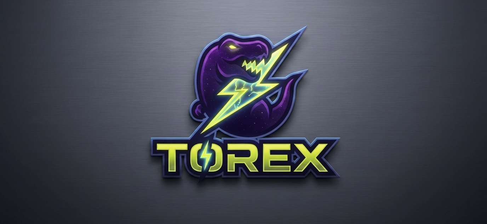

# ⚖️ Torex Codex: The Masterclass in Stealth Architecture
> **[META WARNING: THE KING'S COURT]**
> This entire repository is written in a high-octane, arrogant "King" persona for entertainment and filtering purposes. If you lack a sense of humor, please close this tab immediately. The tone is a roleplay; however, the engineering, the 5+ year battery reality, and the 68ms execution logs are **dead serious**.
Why pay a $299 "G-Tax" for a plastic esports mouse? The speed isn't in the brand logo. It's in the protocol stack. 
The same sub-millisecond, zero-latency 2.4GHz wireless technology that powers top-tier professional gaming gear is available to you right now, on a $5 ESP32 chip. 
### ⚡ The 68-Millisecond Proof (Real-World Evidence)
* **Raw Binary. No Parsing. No Waste.** We do not speak JSON. To parse is to admit complexity.
* **No Handshake. No Delay. No Mercy.** We do not waste precious seconds begging for permission via DHCP and TLS handshakes.
* **Strictly Isolated Architecture.** ESP-NOW encrypted nodes and the MQTT Gateway operate on physically separated hardware. No cross-protocol contamination.
You attempted to build a secured network and blindly accepted defeat because you trusted official hardware limitations. Your understanding of low-level networking is what is broken.
The full architectural breakdown, visual proofs of supremacy, and the 17 Knights Survival Core blueprint are documented in the official archives.
👉 **[Access the Full Codex and Early Vanguard Blueprint](https://torex-codex.github.io/Torex-Codex/)**

---

*“Show me what you can do.”*

---
