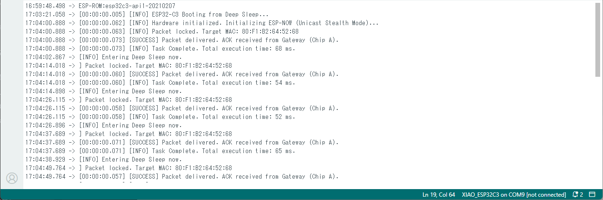
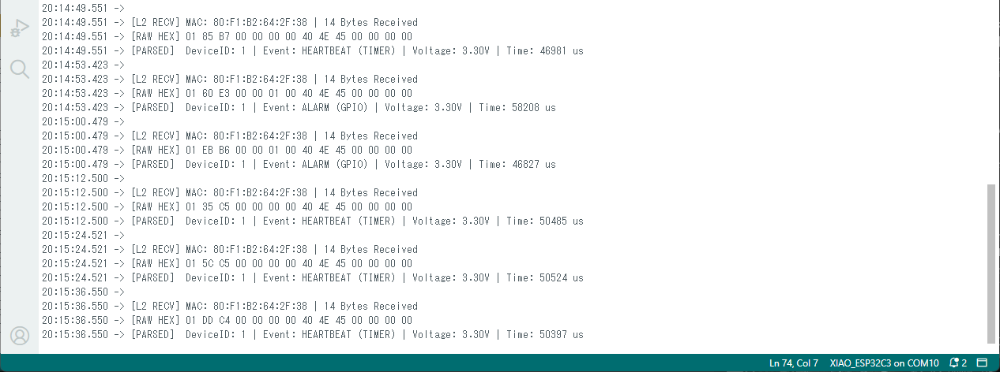
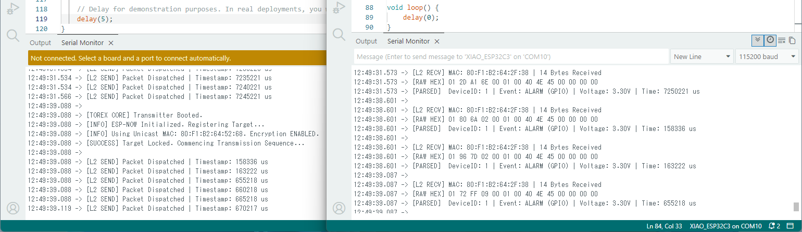
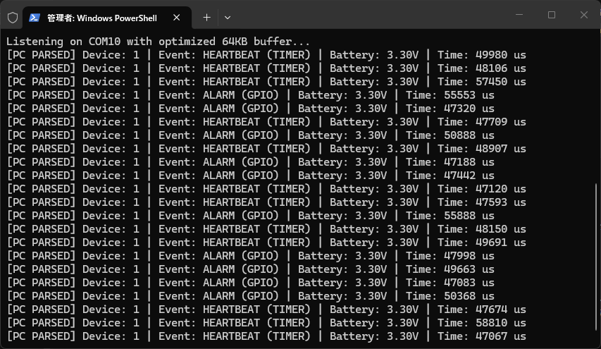
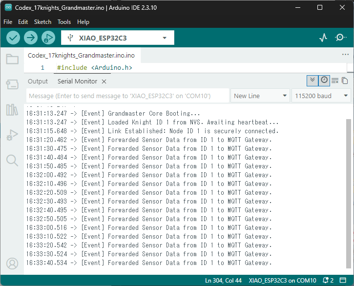
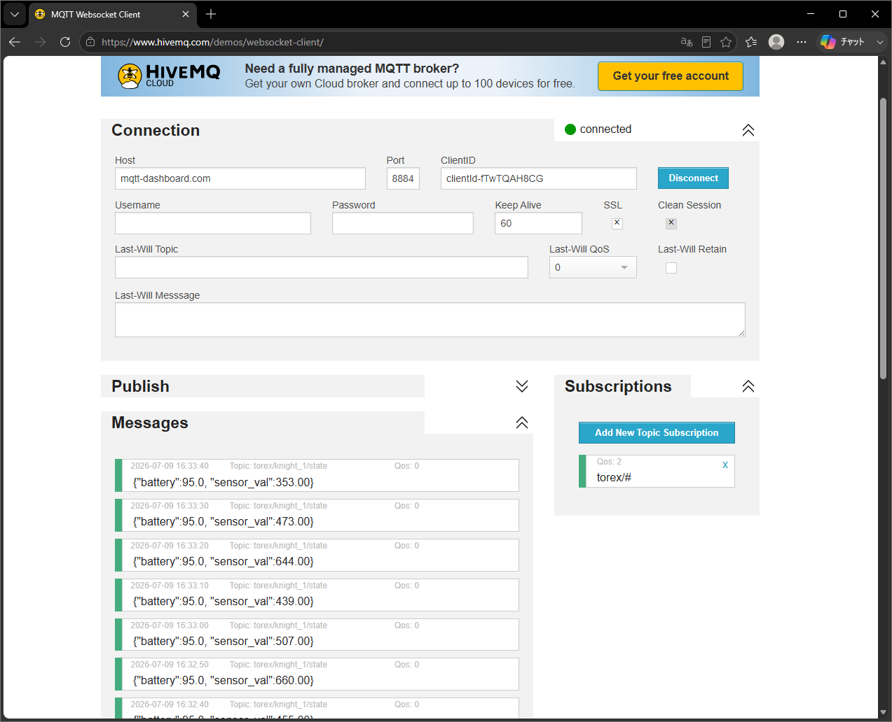
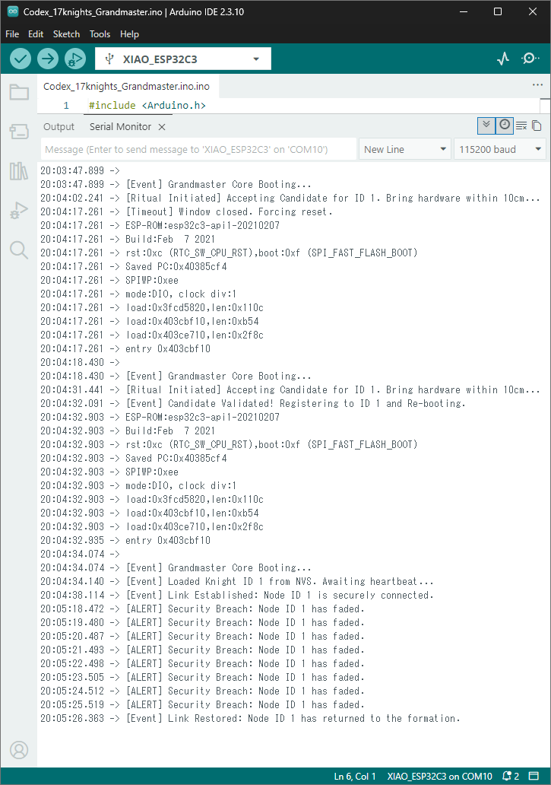

# ⚖️ Torex Codex: The Masterclass in Stealth Architecture

> **[META WARNING: THE KING'S COURT]**
> This entire repository is written in a high-octane, arrogant "King" persona for entertainment and filtering purposes. If you lack a sense of humor, cannot read the room, or are easily offended by words like "amateur," please leave immediately. The tone is a roleplay; however, the engineering, the 5+ year battery reality, and the 68ms execution logs are **dead serious**.
### They call it "LIGHTSPEED". I call it "Raw 2.4GHz Physics".

Why pay a $150 "G-Tax" for a plastic esports mouse? The speed isn't in the brand logo. It's in the protocol stack. 
The same sub-millisecond, zero-latency 2.4GHz wireless technology that powers top-tier professional gaming gear is available to you right now, on a $5 ESP32 chip. 

Logitech sells you the fish. **I am selling you the ocean.**

Welcome to the **Torex Codex**. "Are you still shouting into the void? Broadcast is for the lazy who can’t handle a proper peer connection. A messy network is the signature of a messy mind."

Stop flooding the 2.4GHz airwaves with your garbage multi-threaded architecture.

If you are here, you’ve probably realized that the official Espressif documentation for ESP-NOW is an insult to human intelligence. They give you the lego blocks, but they forget to tell you they don't fit together out of the box.

You tried to build a secured smart home with 50 nodes, and you realized that enabling encryption slashes your peer limit down to just 17—or even a pathetic 7 by default. `ESP_ERR_ESPNOW_NO_MEM` crashed your entire network, and you blindly accepted defeat because you trusted their hardware limitations.

You thought ESP-NOW was broken? No. Your understanding of low-level networking is what's broken.

---

## ⚡ The 68-Millisecond Proof (Real-World Evidence)

True mastery means whispers that reach exactly who needs to hear. Not a megaphoned circus. Look at the timestamps from a cold boot on an ESP32-C3 sensor node using this architecture:



**68 milliseconds.** From absolute zero to data delivered and power down. No Wi-Fi handshake lag. No channel drift. Just pure, unadulterated efficiency.

*Note: An astute observer might notice the 12-second synchronization intervals in the logs despite the internal 10-second deep sleep timer registry. Do not mistake this protocol timing for a glitch. The reason for this 2-second variance is a sovereign hospitality—a direct mercy granted only to the chosen few who read the actual pages of the Codex. If you wish to uncover the mathematical reality of this physics, the archive link is below.*

**"Unapologetic Signal Penetration."**
We do not whisper to the air; we command it. Torex operates at the absolute ceiling of regulatory transmit power. While competitors throttle their signals to save pennies on battery, we burn watts to ensure every corner of your facility is saturated with our presence. Our signal does not 'reach' you; it overwhelms the environment. If you are within range, you are already ours. We do not negotiate with obstacles. We obliterate them with raw, unfiltered power.

---

## 🖼️ The Trilogy of Evidence (Visual Proof of Supremacy)

The internet is full of theorists and tutorial-copiers. I don't deal in theory. Here are the three visual proofs that separate the King's architecture from the hobbyist's garbage.

### 1. Raw Binary. No Parsing. No Waste.


We do not speak JSON. We do not speak XML. We do not speak human. We speak machine. Our data is structured binary, parsed directly into memory without a single cycle of interpretation. There is no 'cost' because there is no 'process.' To parse is to admit complexity. We are simple. We are direct. We are efficient. Your CPU does not 'work' for us; it simply *accepts* us. We do not burden your system. We liberate it from the tyranny of overhead. This is not optimization. This is purity.

### 2. No Handshake. No Delay. No Mercy. (The 500Hz Benchmark)


While inferior networks waste precious seconds begging for permission via DHCP and TLS handshakes, Torex ignores the queue. We do not 'reconnect.' We simply *are*. Our Layer-2 integration is continuous, stateful, and instantaneous. To wait for a signal is to admit weakness. We do not wait. We dominate the spectrum without pause.

If you look closely at the timestamp image above, your brain will struggle to comprehend the sequence. The Receiver prints the parsed data *before* the Transmitter even finishes logging that it sent the packet.

Amateurs will immediately scream, *"This is faked! It violates the laws of physics!"* 
They are wrong. They just don't understand hardware bottlenecks. 

In this stress test, I pushed the Transmitter to fire payloads with a `delay(5);`. The 2.4GHz radio wave transmits the payload, the Receiver unpacks it, and the hardware ACK is returned in under **2 milliseconds**. But printing the string `"[L2 SEND] Packet Dispatched"` over a physical USB/UART cable at 115200 baud takes about **5 milliseconds**. 

The radio wave is literally outrunning the physical USB copper wire. By the time the Transmitter finishes drawing the text on your screen, the Receiver has already finished processing the data. 

*(Note: To prevent your PC from crashing under this barrage, the distributed `torex_tx_template.ino` is safely leashed to a 1000ms delay. Lower it to `delay(2)` if you want to witness the absolute maximum hardware clearance limit (500Hz) of the ESP32 MAC layer).*

### 3. The Zero-Cost Pipeline (Full-Stack Completion)


Hobbyists are satisfied when they see text on an Arduino monitor. The King is only satisfied when the backend pipeline is complete. 
This PowerShell console is the final destination. As the `[Parsed]` prefix shows, we do not waste CPU cycles on string `split()` or heavy Regex. The OS serial buffer is expanded to 64KB, and Python's `struct.unpack` reconstructs the raw binary from the airwaves instantly at zero computational cost. Even if your transmitter blasts 500 packets per second, they will align perfectly without a single corrupted byte. Can your intellect keep up with this speed?

---

## 👑 The Architecture: Dual-Chip Isolation (Chip A + Chip B)

The amateur tries to force a single ESP32 to handle both standard Wi-Fi (MQTT/Home Assistant) and ESP-NOW simultaneously. They face channel conflict, packet drops, and thread starvation.

The King solves this at the hardware layer. By spending an extra $5 on a second ESP32, we achieve absolute silicon-level isolation.

```text
[Battery Sensor Node (C3/S3)] 
         │
         │ (Stealth Unicast ESP-NOW / Fixed Channel / <1ms Latency)
         ▼
 ┌────────────────────────────────────────┐
 │ Gateway Receiver: Chip A (ESP32-C3)    │
 └───────────────────┬────────────────────┘
                     │ (Optimized High-Speed UART / No Bloat)
                     ▼
 ┌────────────────────────────────────────┐
 │ Home Assistant Bridge: Chip B (ESP32)  │◄─── (Connected to your Wi-Fi Router)
 └───────────────────┬────────────────────┘
                     │ (Zero-Conf MQTT Discovery)
                     ▼
             [Home Assistant]
```

*   **Chip A (Grandmaster)**: Dedicates its entire RF frontend to ESP-NOW on a fixed, silent channel. Zero packet loss.
*   **Chip B (Gateway)**: Standard Wi-Fi station mode. Bridges the data to your Home Assistant via MQTT without ever disturbing the ESP-NOW airwaves.

### Visual Proof: The Seamless MQTT Bridge



**Look at the timestamps.** The exact millisecond the Grandmaster receives the encrypted ESP-NOW payload, the Gateway fires the JSON over standard Wi-Fi to the MQTT broker. Absolute silicon-level isolation means zero thread starvation and zero missed packets. One chip for encrypted RF survival. One chip for network routing. Perfection.

---

## 🏰 Advanced Application: The 17 Knights Survival Core



We do not hardcode MAC addresses like amateurs. Our nodes use a proximity **'Ritual'** to dynamically pair within 10cm, instantly saving to non-volatile storage (NVS). But we don't stop there. 

The Grandmaster continuously monitors link health. If a node loses power or is compromised, the system instantly flags a `[Security Breach]`. When it returns, `[Link Restored]` is logged. This is military-grade state management, not a hobbyist beacon.

---

## 📦 What's Inside The Box ($150 Early Access)

```text
💾 Torex_Codex.zip (Total Infrastructure Package)
├── 📖 TOREX_ULTIMATE_GUIDE.md          <-- The ultimate ESP-NOW optimization and disclaimer codex (Manual)
│
├── 📡 [The Core Transmitters]
│   ├── torex_tx_template.ino        # The baseline un-bloated Tx node
│   └── torex_sensor_deepsleep.ino   # The 68-millisecond deep-sleep anomaly
├── 🎯 [The Core Receivers]
│   ├── torex_rx_human_monitor.ino   # Human-readable HEX dump for Arduino IDE
│   └── torex_rx_machine_bridge.ino  # Pure binary output designed for Python
├── 🐍 [The PC Integration]
│   └── torex_pc_parser.py           # The Python script that unpacks the binary flawlessly
├── 🏰 [Advanced Application: The 17 Knights] (Dynamic Encryption & Survival Core)
    ├── 🛡️ [Base Architecture]
    │   ├── ⚔️ Codex_17Knights_Grandmaster.ino <-- Master Receiver. Pure encrypted pairing and heartbeat core.
    │   └── 🛡️ Codex_17Knights_01_17.ino       <-- Knight Node. AES-128 encrypted payload with zero bloat.
    │
    └── 🌉 [MQTT Empire Bridge]
        ├── 👑 Codex_17Knights_Grandmaster_MQTT.ino <-- The King's Bridge. Translates 17 Knights to Home Assistant.
        └── 🛡️ Codex_17Knights_01_17_MQTT.ino       <-- Knight Node (MQTT optimized payload).
│
└── ⚖️ LICENSE.md                           # The Royal License (Commercial Rights + Absolute Shield)
```

---

## 🛑 Stop Wasting Your Life. Buy The Solution.

I have already solved dynamic proximity pairing (eliminating hardcoded MAC addresses without relying on insecure broadcasting), structural padding, C3/S3 hardware abstraction, and the painful Home Assistant MQTT Discovery auto-configuration logic.

**The theory is free.** You can read this README, go back to your IDE, and waste the next 3 nights of your life trying to replicate this setup, debugging corrupted JSON buffers and missing ACKs.

---

### 🛡️ Disclaimer of the Absolute Law
*This architecture is built on the universal logic of the ESP-IDF physical layer. I formulated these templates on the ESP32-C3 and S3, but the underlying wireless law is identical across all silicon. If your specific custom dev board behaves erratically, it is not a flaw in the system code—it is a deficiency in your hardware's board support package or your wiring discipline. Resolve it yourself.*

### 🎭 The Final Execution
**The binary fields have been written. The compilation errors have been eradicated. The code is complete.**
I will not waste my time providing curated video evidence to convince you. The execution is flawless. The logic is absolute. Flash the Grandmaster core into your master node, deploy the knights to your perimeters, and witness the silence yourself. 

Go forth, configure your army, and post your deployment logs. Show me that your intellect is worthy of the 17 Knights.

---

## 🏛️ Accessing the Archives (The Early Vanguard Privilege)

Whether you consider **$150** high or low is an exact reflection of how you value your own intellect—and your time. If you believe three nights of your life spent debugging dropped packets, corrupted struct padding, and broken Wi-Fi channels is worth less than $150, then this repository is not for you. Leave immediately and quietly. Your silence is your admission.

### 📦 Exact Product Details & What's Included:
- **Product Name:** Torex Codex: The Masterclass in Stealth Architecture (Total Infrastructure Package)
- **Included Assets:** Complete Source Code (Transmitters, Receivers, PC Integration scripts, 17 Knights Survival Core, MQTT Empire Bridge) and the TOREX_ULTIMATE_GUIDE.md optimization manual.
- **Delivery Method:** Immediate digital download (.zip archive) automatically delivered via email upon successful transaction completion.

### 🏁 Claim Your Blueprint Instantly:
Select your preferred imperial treasury below to execute the zero-cost shortcut. Payment is handled securely via Paddle, a globally licensed payment processor.

**💳 [Claim the Torex Codex — $150](チェックアウトURL)**

*Taxes may apply and will be calculated at checkout.*


---

*“Show me what you can do.”*

---

### Legal & Compliance
* [Terms of Service](TERMS.md)
* [Privacy Policy](PRIVACY.md)
* [Refund & Return Policy](REFUND.md)
* 📬 Contact: [GitHub Issues](https://github.com/torex-codex/Torex-Codex/issues)
